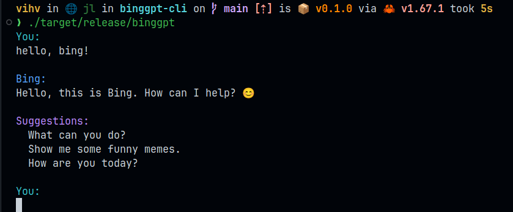

<div align="center">
    

# BingGPT

*BingGPT command line client, written in rust*



---

</div>

[中文说明](README_CN.md)

This project is a rust language implementation of [EdgeGPT](https://github.com/acheong08/EdgeGPT), all the hard stuff was done by the original project author `acheong08`, I just wrote it in rust, all credit goes to him, thanks for the hard work big guy!

## Install

```bash
cargo install binggpt
```

## Requirements

You must have a Microsoft account with access to BingGPT.

## Configuration (required)

- for [Chrome](https://chrome.google.com/webstore/detail/cookie-editor/hlkenndednhfkekhgcdicdfddnkalmdm) or [Firefox](https://addons.mozilla.org/en-US/firefox/addon/cookie-editor/) to install the `cookie-editor` extension
- Go to [bing.com](https://www.bing.com) and log in to your Microsoft account
- Open the extension
- Click "Export" in the bottom right corner (this will save your cookies to the clipboard)
- Create or write your cookies to the `~/.config/bing-cookies.json` file

## Usage

> First you need to perform the configuration steps above.

If you have a rust development environment, first you need to clone the code, go to this project directory, and run `cargo run`.

If you want to compile it into binaries, you can run `cargo build --release`. After the compilation is done, you can find the compiled binaries in the `target/release` directory.

If you want to install it to the system, you can run `cargo install --path .`, so you can easily use the `binggpt` command anywhere.

After starting the program, when you see `You:`, it means you can start a conversation with BingGPT, press enter twice to send a message.

In the conversation, you can use the following command.

- `:q` `:quit` `:exit` to quit the program
- `:more` to enter multi-line mode, where you can safely type more text, or paste text from the clipboard
- `:end` exit multi-line mode

## Work in progress

## License

[MIT](LICENSE)