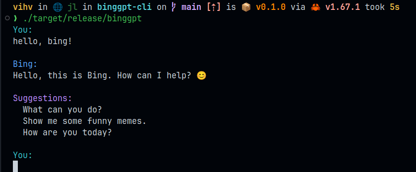

<div align="center">
    

# BingGPT

_BingGPT 命令行客户端，使用 rust 编写_



---

</div>

> 这个仓库已经很多天没有更新过了，以后可能也不会更新，建议您切换到[aichat](https://github.com/sigoden/aichat).

这个项目是 [EdgeGPT](https://github.com/acheong08/EdgeGPT) 的 rust 语言实现，所有困难的事情都是原项目作者 `acheong08` 完成的，我仅仅是用 rust 写了一遍，所有的功劳都归功于他，感谢大佬的辛勤付出！

## 安装

```bash
cargo install binggpt-cli
```

```bash
# 执行
binggpt
```

或者从 [release](https://github.com/jlvihv/BingGPT/releases) 页面下载预编译的二进制文件。

## 要求

你必须有一个可以访问 BingGPT 的微软账户。

## 配置 (必须的)

- 为 [Chrome](https://chrome.google.com/webstore/detail/cookie-editor/hlkenndednhfkekhgcdicdfddnkalmdm) 或 [Firefox](https://addons.mozilla.org/en-US/firefox/addon/cookie-editor/) 安装 `cookie-editor` 扩展
- 去 [bing.com](https://www.bing.com) 登录你的微软账户
- 打开扩展
- 单击右下角的“Export”（这会将您的 cookie 保存到剪贴板）
- 将您的 cookie 新建或写入到 `~/.config/bing-cookies.json` 文件中

## 使用方法

> 首先你需要执行上面的配置步骤。

如果你有 rust 开发环境，首先你需要克隆代码，进入本项目目录，然后运行 `cargo run` 。

如果你想编译成二进制文件，可以运行 `cargo build --release`，编译完成后，你可以在 `target/release` 目录下找到编译好的二进制文件。

如果你想安装到系统中，可以运行 `cargo install --path .`，这样你就可以方便的在任何地方使用 `binggpt` 命令了。

启动程序后，当看到`You:`时，表示你可以开始与 BingGPT 对话了，按两次回车键，即可发送消息。

在对话中，你可以使用如下指令：

- `:q` `:quit` `:exit` 退出程序
- `:more` 进入多行模式，你可以放心的输入更多文本，或者从剪贴板中粘贴文本
- `:end` 退出多行模式

## 可能遇到的问题

### Windows10 用户

见 [#3](https://github.com/jlvihv/BingGPT/issues/3)

确保运行 Windows 10 的用户在其终端中使用此命令并具有管理员权限，以在终端中启用文本颜色。

```powershell
reg add HKCU\Console /v VirtualTerminalLevel /t REG_DWORD /d 1
```

## 针对国内用户的特别说明

如果国内 IP 无法使用，你需要想办法换国外 IP 试试。

## 作为 rust crate 使用

```bash
cargo add binggpt
cargo add utf8-slice
cargo add tokio --features full
```

```rust
use std::io::{stdout, Write};

#[tokio::main]
async fn main() {
    let mut bing = binggpt::Bing::new("~/.config/bing-cookies.json")
        .await
        .unwrap();

    // send message
    bing.send_msg("hello").await.unwrap();

    // receive message
    let mut index = 0;

    // loop until the chat is done
    loop {
        if bing.is_done() {
            break;
        }

        let Some(answer) = bing.recv_text().await.unwrap() else{
            continue;
        };

        // print the new part of the answer
        if !answer.is_empty() {
            print!("{}", utf8_slice::from(&answer, index));
            if stdout().flush().is_err() {
                println!("Warning: Failed to flush stdout");
            };
            index = utf8_slice::len(&answer);
        }
    }
}
```

## 贡献者

这个项目的存在要感谢所有作出贡献的人。

 <a href="https://github.com/jlvihv/BingGPT/graphs/contributors">
  
 </a>

## License

[MIT](LICENSE)
